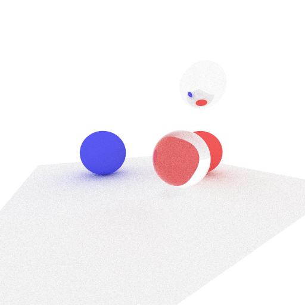
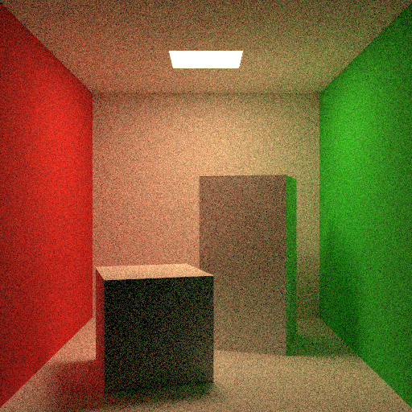

# pbr-lecture-2020

[p-ray](https://p-ray.oskt.us/)の2020年度講義: 物理ベースレンダリング回のリポジトリです。



演習用のディレクトリやリファレンス実装が含まれています。CMakeを用いて簡単にビルドが行なえます。

## Requirements

* C++17
* CMake 3.12 or Higher
* OpenMP (並列化を利用する場合)

## ディレクトリ構造

```
.
├── CMakeLists.txt
├── LICENSE
├── README.md
├── ref           リファレンス実装
└── src           演習で実装していく部分
```

リファレンスには以下の例が含まれています。

|Name|Description|
|:--|:--|
|`ref/src/`|リファレンス実装のレンダラー|
|`ref/spheres.cpp`|球で構成されるシーン|
|`ref/cornell-box.cpp`|コーネルボックス|

## Build

ビルド用のディレクトリbuild を作成した後、CMakeを利用してビルドを行います。

```
mkdir build
cd build
cmake -DCMAKE_BUILD_TYPE=Release ..
cmake --build .
```

デバッグモードでビルドしたい場合は-DCMAKE_BUILD_TYPE=Releaseを-DCMAKE_BUILD_TYPE=Releaseに変更してください。

また、リファレンスもビルドしたい場合は、以下のようにCMakeオプションBUILD_REFERENCEをOnにしてください。

```
cmake -DBUILD_REFERENCE=On ..
```

## Gallery

### spheres


### cornell-box



### cornell-box2

